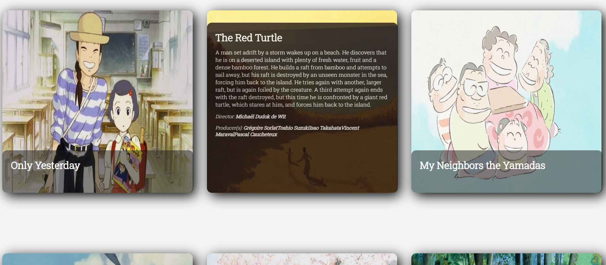

# Studio-Ghibli-Catalog
A fullstack catalog for Studio Ghibli's productions. Get to know more about your favorite animation film!

## Table of contents

- [General view](#general-view)
  - [The Challenge](#the-challenge)
  - [Images](#images)
  - [Links](#links)
- [The development process](#the-development-process)
  - [Tools used](#tools-used)
  - [Lessons learned](#lessons-learned)
- [Usage](#usage)
- [Testing](#testing)
- [TroubleShooting](#troubleshooting)
- [Author](#author)

## General view

### The challenge

Studio Ghibli Catalog is a project that shows the current Studio's productions, listed by pages of 10 by 10, while it's possible to show them all.

**The users are be capable of**

- Read a selected data from Studio Ghibli's API;
- Page through the collection, limiting the list to a number of 10.

## Images

<div align="center">
  
  
  
</div>


## The development process

### Tools used

#### Front-end

- TypeScript
- React
- Axios
- React - custom hooks
- SASS CSS
- React Testing Library

#### Back-end

- TypeScript
- Postgres
- Node.js
- Express.js
- Prisma
- cors
- express-async-errors
- Jest

#### Deployment

- Front-end: Vercel
- Back-end (only database): Supabase 

#### Documentation

- Docusaurus

### Lessons learned

In this project I could improve my knowledge in both front-end and back-end, by:

- Using and learning about new libraries and frameworks and its applicabilities, namely Prisma and Docusaurus.
- Creating a fake database to make end to end tests.
- Fetching the backend using axios actions.

## Usage

```bash
git clone 'git@github.com:calopessoa/studio-ghibli-catalog.git'
```

```bash
cd studio-ghibli-catalog
```

- You'll have access to the backend and frontend folders, in order to build up the API, run:

```bash
cd backend
```

```bash
npm run dev
```

:::info

It's possible to run tests, still in the backend folder, run:
```bash
npm test
```

:::

Then, you are ready to launch the frontend:

```bash
https://studio-ghibli-catalog-eight.vercel.app/
```

## Author

- LinkedIn - [Carlos Augusto Lopes de Oliveira](https://www.linkedin.com/in/carlos-augusto-lopes-de-oliveira-2602458b/)


